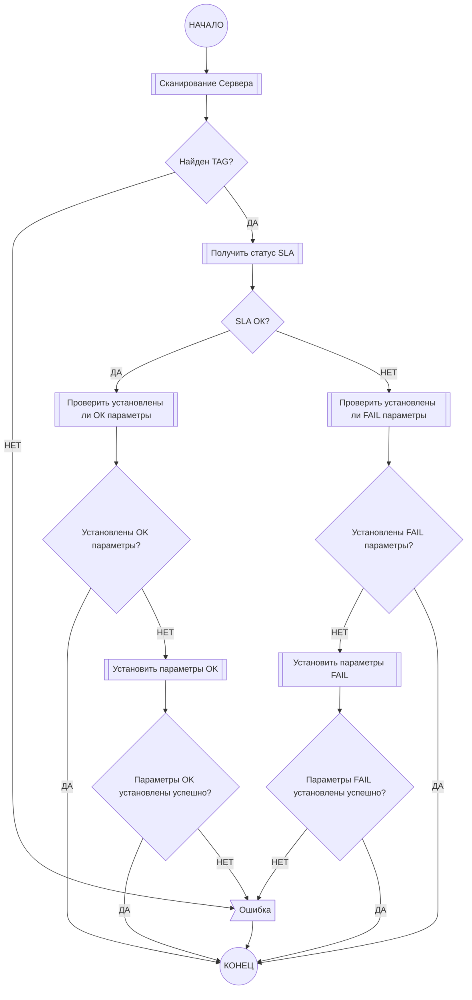

# SLA Monitor

Check CISCO SLA and send SNMP command if failed

## Requirements

* Python3
* snmp-utils

## sla-snmp.py

```shell
Get data from SLA server and set SNMP value

Server:
  --server                  IP роутера CISCO
  --server-port             SNMP порт (по умолчанию 161)
  --server-snmp-version     Версия SNMP протокола (по умолчанию 2c)
  --server-read-community   SNMP Community для чтения данных (по умолчанию public)
  --tag                     SLA tag результат работы которого нужно проверить

Client:
  --client                  IP SNMP клиента
  --client-port             SNMP порт (по умолчанию 161)
  --client-snmp-version     Версия SNMP протокола (по умолчанию 2c)
  --client-read-community   SNMP Community для чтения данных (по умолчанию public)
  --client-write-community  SNMP Community для записи данных (по умолчанию private)
  --oid-ok                  Данные для установке в случае успешного теста (формат oid:type:value)
  --oid-fail                Данные для установке в случае неуспешного теста (формат oid:type:value)

Logging:
  -v, --verbose             Выводить подробный лог
  -l LOG, --log             Путь к файлу лога
```

## Схема работы


## Примеры

### sla-snmp.sh

```bash
#!/usr/bin/env bash

./sla-snmp.py \
  --log="/var/log/sla-snmp.log" \
  --server="x.x.x.x" \
  --server-read-community="public" \
  --tag="TEST-PING" \
  --client="y.y.y.y" \
  --client-read-community="public" \
  --client-write-community="private" \
  --oid-ok="iso.3.6.1.4.1.6247.34.1.2.3.1.0:I:70000000" \
  --oid-ok="iso.3.6.1.4.1.6247.34.1.2.2.1.0:I:71000000" \
  --oid-fail="iso.3.6.1.4.1.6247.34.1.2.3.1.0:I:60000000" \
  --oid-fail="iso.3.6.1.4.1.6247.34.1.2.2.1.0:I:61000000" \
  $@
```

### cron

```bash
*/5 * * * * /usr/local/bin/sla-snmp.sh > /tmp/sla_snmp_last.log 2>&1
```

### logrotate

```bash
/var/log/sla-snmp.log {
        daily
        missingok
        rotate 7
        compress
        delaycompress
        notifempty
        create 644 root adm
}
```